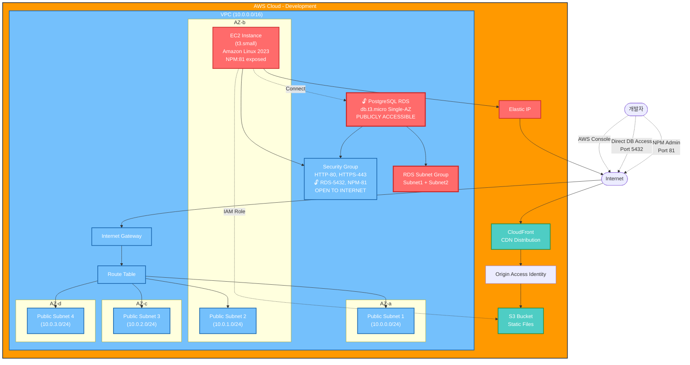
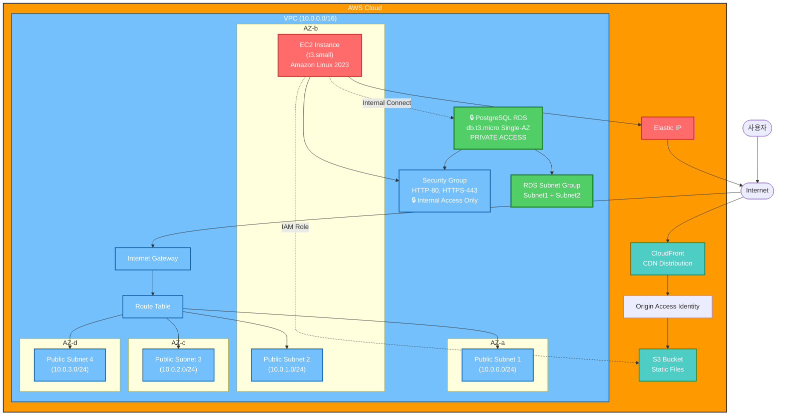

# Re-Life Infrastructure
AWS 기반 인프라 관리 및 배포를 위한 Terraform 코드와 관련 문서입니다.

## Prerequisites
- AWS CLI 설치 및 구성
- [Terraform](https://www.terraform.io/downloads.html) 설치

## Structure
### - Diagram
```
infra/
├── main.tf                   # AWS 인프라 리소스 정의
├── variables.tf              # Terraform 변수
├── terraform.tfvars          # Terraform 변수 값
└── ec2_user_data.tpl         # EC2 초기화 스크립트 템플릿
```

## Infrastructure Diagrams

<details>
<summary>🔧 개발 환경 구성도 (Development Mode)</summary>

> **주의**: 개발 목적으로 RDS 포트(5432)와 NPM 관리 포트(81)가 외부에 노출되어 있습니다.



**현재 설정값 (variables.tf):**
- PORT
  - `expose_rds_port = true` 🔓
  - `expose_npm_config = true` 🔓
- RDS 외부 접근
  - `publicly_accessible = true`

</details>

<details>
<summary>🔒 프로덕션 환경 구성도 (Production Mode)</summary>

> **보안**: 프로덕션 환경에서는 RDS와 NPM 관리 포트가 내부에서만 접근 가능합니다.

**프로덕션 권장 설정값:**
- PORT
  - `expose_rds_port = false` 🔒
  - `expose_npm_config = false` 🔒
- RDS 외부 접근
  - `publicly_accessible = false`

**접근 방법:**
- RDS: EC2를 통한 터널링 또는 VPN
- NPM 관리: EC2 SSH 터널링



**프로덕션 권장 설정값:**
- `expose_rds_port = false` 🔒
- `expose_npm_config = false` 🔒
- `publicly_accessible = false` (RDS)

**접근 방법:**
- RDS: EC2를 통한 터널링 또는 VPN
- NPM 관리: EC2 SSH 터널링

</details>

## Usage
> ***시작하기 전..***
> * 해당 설정은 개인 AWS 계정에서 진행하는 것을 권장합니다.
> * 기존에 동일한 AWS Access ID 및 Secret Key를 사용하는 경우, 기존에 생성된 리소스에 영향을 줄 수 있습니다.

#### 1. AWS 자격 증명 설정
    * AWS CLI를 통해 자격 증명을 설정합니다.
    * `aws configure` 명령어를 사용하거나 환경 변수를 설정할 수 있습니다.

#### 2. `terraform.tfvars` 파일에서 변수 값 설정
* `terraform.tfvars.default` 파일을 복사하여 `terraform.tfvars` 파일을 생성한 후, 각 변수에 맞는 값을 입력합니다.
* 주의
    * 해당 파일은 민감한 정보를 담는 공간으로 사용됩니다.
    * 절대 외부로 유출되지 않도록 주의해주세요.
    * Git 저장소에 커밋하지 마세요.

#### 3. 터미널
```terraform
# infra 디렉토리에서 진행

# 초기화 
terraform init

# 인프라 구성 검토
# terraform plan 

# 인프라 구성 적용
# 'yes' 입력 시 구성 시작
terraform apply

# 리소스 삭제
# 'yes' 입력 시 리소스 삭제 시작
terraform destroy
```

#### 4. `terraform apply` 완료 이후
* RDS <-> 보안 그룹 설정 (스크립트가 제대로 동작하지 않을 수 있으므로 직접 설정을 권장합니다.)
* EC2 인스턴스에 접속(대시보드 Session Manager로 접속 권장)하여 어플리케이션 설정
  * ghcr.io 로그인 확인
  * Redis 확인
  * NPM 확인 (NPM 콘솔 접속이 안 되는 경우, `variables.tf` 파일 - `expose_npm_config` 변수 확인)
* CD 스크립트 실행

마지막 수정일: 2025-09-28